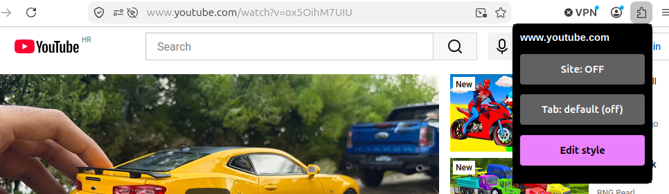
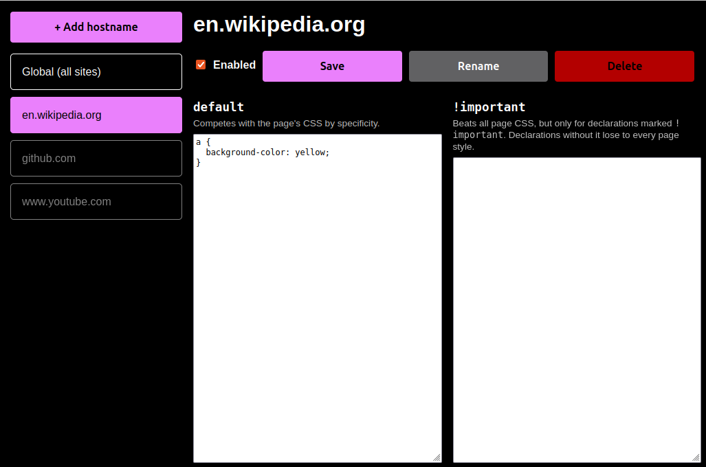

# CSS Override With Global

A Firefox extension for applying your own CSS to websites: per site, to every site at once, or just to the tab you're looking at.

**Firefox Add-ons:** https://addons.mozilla.org/en-US/firefox/addon/css-override-with-global/

## Screenshots

The popup shows the current site, with toggles for the site and for this tab:

The editor lists all your saved styles on the left:

## Features

- **Per-site styles.** Styles are matched by exact hostname, so `www.youtube.com` and `youtube.com` are separate entries.
- **Global style.** The *Global (all sites)* entry applies to every page. Site styles are applied after it, so they win when rules conflict.
- **Two strengths of CSS.** Each entry has two boxes:
  - **default**: normal CSS that competes with the page's own styles by specificity, the same way the page's stylesheets do.
  - **!important**: injected as a *user* stylesheet. Declarations marked `!important` here beat everything the page does, including its own `!important` rules and inline styles. Declarations without `!important` lose to every page style, so mark each one.
- **Per-tab override.** Turn a site's style on or off for one tab without changing it for the others.
- **Live updates.** Saving a style updates open tabs right away, with no reload.
- **Synced.** Styles are stored with Firefox Sync, so they follow you across devices when you're signed in.

## Usage

### Popup

Click the toolbar button on any page:

| Button | What it does |
|---|---|
| **Site** | Turns this site's style on or off in every tab that has a matching hostname. |
| **Tab** | Overrides the site toggle for this tab only. The first click always flips what you see; clicking through all the states returns it to *default*, which follows the site toggle. The override only applies while the tab is on this site. |
| **Edit style** | Opens the editor on this site's entry. |

On pages without a hostname (such as `about:` pages and local files), the toggles are disabled.

### Editor

- Pick an entry from the list, edit its CSS and click **Save** (or press <kbd>Ctrl</kbd>+<kbd>S</kbd>).
- **Enabled** turns the entry on or off. For *Global (all sites)* this is the global style's on/off switch.
- **+ Add hostname** creates an entry. You can paste a full URL; only the hostname is kept.
- **Rename** moves an entry to a different hostname, for example to fix a typo.
- **Delete** removes the entry.

Firefox Sync allows about 8 KB per entry, shared by both CSS boxes. If a save is too large, the editor shows an error and keeps your changes unsaved.

## Permissions

| Permission | Why |
|---|---|
| Access your data for all websites | Inject your CSS into the pages you choose. |
| `tabs`, `activeTab` | Read the current tab's address to find its hostname. |
| `webNavigation` | Re-apply styles when a page loads. |
| `sessions` | Remember a tab's override for that tab only. |
| `storage` | Save your styles. |

The extension doesn't collect or send any data. Styles only leave your browser through Firefox Sync, if you use it.

## Credits

This is a fork of [css-override-web-extension](https://github.com/swcolegrove/css-override-web-extension) by [Scott Colegrove](https://github.com/swcolegrove), published on Firefox Add-ons as [CSS Override](https://addons.mozilla.org/en-US/firefox/addon/css-override/). The fork adds the global style, the per-tab override, the `!important` box, the new editor, and live updates without reloading tabs.

## License

ISC, like the original project.
